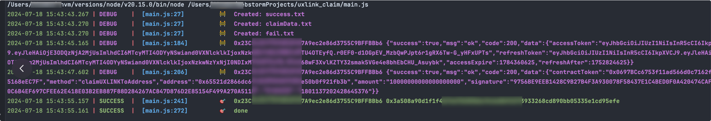

# uxlink领取脚本 

网站 https://reward.uxlink.io/claim

## 运行截图



## 安装

在项目根目录下，执行以下命令来安装项目依赖：

```bash
npm i
```

首先，您需要在 keys.txt 文件中输入相关的信息。请确保按照下面的格式添加您的信息（例如，地址、私钥等），一行一个：

```bash
地址----私钥
私钥
```

## 运行

然后，运行以下命令来启动程序：

```bash
node main.js
```

## 请我一杯咖啡

如果你觉得这个项目对你有帮助，可以请我喝一杯咖啡，谢谢！

SOL地址: EfDZm8wdkFU7JD8ACeWeJ54xaBVPWiZUKKmLSkN6WUzu

evm地址: 0xD70C7F06C07152Acb16D20012572250F57EEA624
